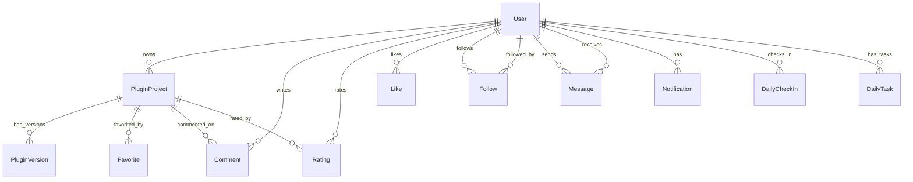

# 数据库 & 公共基础设施 — 技术设计文档

## 1. 设计概要

**功能描述**：设计 PluginGen 的数据库模型（Prisma Schema 11 张表 + 4 个枚举）、后端公共基础设施（PrismaService、JwtAuthGuard、ExceptionFilter、TransformInterceptor、ValidationPipe、@CurrentUser/@Public 装饰器）、前端公共基础设施（Axios 封装、WebSocket 客户端、Zustand Stores、TopNav/Footer 布局组件）。

**影响范围**：后端 `prisma/` + `common/` 目录、前端 `lib/` + `stores/` + `components/layout/`。这是所有后续业务模块的基座，后续每个 Phase 都会依赖本阶段的产出。

**技术难点**：无（标准 NestJS + Prisma 模式，已有成熟的社区实践）。

**外部依赖**：`@prisma/client`、`prisma`（已规划）、`@nestjs/jwt`、`@nestjs/passport`、`passport`、`passport-jwt`、`axios`、`zustand`。

---

## 2. 架构概览

```
后端数据流（请求生命周期）:

Incoming HTTP Request
       │
       ▼
  JwtAuthGuard ─── @Public() 跳过 ─── 401 未认证
       │
       ▼
  ValidationPipe ─── DTO 校验 ─── 400 校验失败
       │
       ▼
  Controller ─── @CurrentUser() 注入用户
       │
       ▼
  Service ─── PrismaService (全局单例)
       │
       ▼
  TransformInterceptor ─── 包裹为 { code, data, message }
       │
       ▼
  AllExceptionsFilter ─── 捕获未处理异常 → 统一错误格式
       │
       ▼
Incoming Response


前端数据流:

  Page/Component
       │
       ├── api-client.ts (Axios + JWT 注入)
       │     └── /api/* → Vite proxy → NestJS :3000
       │
       ├── ws-client.ts (WebSocket + 自动重连)
       │     └── /ws/* → Vite proxy → NestJS :3000
       │
       ├── stores/ (Zustand)
       │     ├── auth-store → 用户登录态 + Token
       │     └── ui-store → 侧栏、主题等 UI 状态
       │
       └── components/layout/
             ├── TopNav (64px, bg-canvas)
             └── Footer (bg-surface-dark)
```

---

## 3. 数据库设计

### 3.1 枚举定义

```prisma
enum CoreType {
  BUKKIT
  SPIGOT
  PAPER
  PURPUR
  BUNGEECORD
  VELOCITY
}

enum ProjectStatus {
  DRAFT       // 草稿（AI 生成后未修改）
  MODIFIED    // 已修改
  COMPILING   // 编译中
  COMPILED    // 编译成功
  FAILED      // 编译失败
}

enum CompileStatus {
  PENDING
  COMPILING
  SUCCESS
  FAILED
}

enum TargetType {
  PLUGIN
  COMMENT
}
```

→ AC-003：CoreType 枚举 6 值

### 3.2 用户表 `User`

```prisma
model User {
  id          String    @id @default(uuid())
  email       String    @unique
  password    String    // bcrypt 哈希
  nickname    String
  avatar      String    @default("https://api.dicebear.com/9.x/initials/svg?seed=PluginGen")
  bio         String?
  level       Int       @default(1)
  exp         Int       @default(0)
  dailyQuota  Int       @default(20)
  createdAt   DateTime  @default(now())
  updatedAt   DateTime  @updatedAt

  // Relations
  plugins      PluginProject[]
  checkIns     DailyCheckIn[]
  dailyTasks   DailyTask[]
  comments     Comment[]
  ratings      Rating[]
  likes        Like[]
  followers    Follow[]          @relation("following")
  following    Follow[]          @relation("follower")
  sentMessages    Message[]     @relation("sender")
  receivedMessages Message[]    @relation("receiver")
  notifications Notification[]

  @@index([email])
}
```

→ AC-001：11 字段确认

### 3.3 插件项目表 `PluginProject`

```prisma
model PluginProject {
  id            String        @id @default(uuid())
  userId        String
  name          String
  description   String?
  mcVersion     String        // e.g. "1.20.1"
  coreType      CoreType
  javaVersion   String        // e.g. "17"
  packageName   String        // e.g. "com.example.myplugin"
  status        ProjectStatus @default(DRAFT)
  currentVersion Int          @default(0)
  isPublished   Boolean       @default(false)
  downloadCount Int           @default(0)
  favoriteCount Int           @default(0)
  starCount     Int           @default(0)
  createdAt     DateTime      @default(now())
  updatedAt     DateTime      @updatedAt

  // Relations
  user      User             @relation(fields: [userId], references: [id], onDelete: Cascade)
  versions  PluginVersion[]

  @@index([userId])
  @@index([isPublished, createdAt])
  @@index([coreType])
  @@index([mcVersion])
}
```

→ AC-002：13 字段 + 4 个索引

### 3.4 插件版本表 `PluginVersion`

```prisma
model PluginVersion {
  id            String        @id @default(uuid())
  pluginId      String
  version       Int
  filesManifest Json          // JSON: { "files": { "path": "content" } }
  compileStatus CompileStatus @default(PENDING)
  compileLog    String?       // Maven 编译输出日志
  createdAt     DateTime      @default(now())

  // Relations
  plugin PluginProject @relation(fields: [pluginId], references: [id], onDelete: Cascade)

  @@unique([pluginId, version])
  @@index([pluginId, createdAt])
}
```

→ AC-004：`filesManifest` 为 JSON 类型存储所有文件路径和内容，`compileLog` 可选

### 3.5 社区交互表

```prisma
model Favorite {
  id        String   @id @default(uuid())
  userId    String
  pluginId  String
  createdAt DateTime @default(now())

  @@unique([userId, pluginId])
  @@index([pluginId])
}

model Comment {
  id        String   @id @default(uuid())
  userId    String
  pluginId  String
  content   String
  createdAt DateTime @default(now())

  @@index([pluginId, createdAt])
}

model Rating {
  id        String   @id @default(uuid())
  userId    String
  pluginId  String
  score     Int      // 1-5
  createdAt DateTime @default(now())

  @@unique([userId, pluginId])
  @@index([pluginId])
}

model Like {
  id         String     @id @default(uuid())
  userId     String
  targetId   String
  targetType TargetType
  createdAt  DateTime   @default(now())

  @@unique([userId, targetId, targetType])
  @@index([targetId, targetType])
}

model Follow {
  id          String   @id @default(uuid())
  followerId  String
  followingId String
  createdAt   DateTime @default(now())

  @@unique([followerId, followingId])
  @@index([followingId])
}
```

→ AC-005：5 张社区表，`Favorite` 和 `Rating` 均使用 `@@unique` 复合约束防止重复

### 3.6 通知、私信、签到、任务表

```prisma
model Message {
  id          String   @id @default(uuid())
  fromUserId  String
  toUserId    String
  content     String
  read        Boolean  @default(false)
  createdAt   DateTime @default(now())

  @@index([toUserId, createdAt])
}

model Notification {
  id        String   @id @default(uuid())
  userId    String
  type      String   // "like" | "comment" | "follow" | "favorite"
  data      Json     // { "actorId": "...", "pluginId": "..." }
  read      Boolean  @default(false)
  createdAt DateTime @default(now())

  @@index([userId, createdAt])
}

model DailyCheckIn {
  id        String   @id @default(uuid())
  userId    String
  date      DateTime // 只存日期部分（00:00:00）
  streak    Int      @default(1) // 连续签到天数
  createdAt DateTime @default(now())

  @@unique([userId, date])
}

model DailyTask {
  id        String   @id @default(uuid())
  userId    String
  date      DateTime
  taskType  String   // "generate_plugin" | "publish_plugin" | "comment"
  progress  Int      @default(0)
  completed Boolean  @default(false)

  @@unique([userId, date, taskType])
}
```

→ AC-006：4 张表全部覆盖

### 3.7 关系总图



### 3.8 Migration 执行

```bash
npx prisma migrate dev --name init
```

→ AC-007：Migration 生成后 PostgreSQL 中创建所有表和索引

---

## 4. API 设计

> 本阶段只新增 `/api/health` 一个端点，用于验证基础设施全部运转正常。

### `GET /api/health`

**描述**：健康检查，返回服务运行状态 + 数据库连接状态 → AC-007, AC-008

**鉴权**：`@Public()` + `@UseGuards(JwtAuthGuard)`（标记了 Guard 但用 @Public() 跳过，验证 @Public 机制）

**Response（成功 — 数据库已连接）**：

```json
{
  "code": 200,
  "data": {
    "status": "ok",
    "database": "connected"
  },
  "message": "success"
}
```

**Response（异常 — 数据库断开）**：

```json
{
  "code": 200,
  "data": {
    "status": "error",
    "database": "disconnected"
  },
  "message": "success"
}
```

**异常响应**：

| 场景                                | 状态码 | 响应                                                                | 对应 AC |
| ----------------------------------- | ------ | ------------------------------------------------------------------- | ------- |
| 路径不存在（如 `GET /api/unknown`） | 404    | `{ "code": 404, "message": "Cannot GET /api/unknown", ... }`        | AC-008  |
| 未认证访问受保护接口（无 Token）    | 401    | `{ "code": 401, "message": "Unauthorized" }`                        | AC-009  |
| Token 过期                          | 401    | `{ "code": 401, "message": "Token expired" }`                       | AC-102  |
| DTO 校验失败                        | 400    | `{ "code": 400, "message": "Validation failed", "details": [...] }` | AC-101  |

---

## 5. 核心逻辑

### 5.1 JwtAuthGuard — 认证守卫

**职责**：检查请求头中的 `Authorization: Bearer <token>`，验证 JWT 签名和有效期，将解码后的用户信息注入到请求对象。同时检查 `@Public()` 元数据——如果路由标记了 `@Public()`，跳过认证。→ AC-009, AC-202

```typescript
// 关键实现逻辑
@Injectable()
export class JwtAuthGuard extends AuthGuard('jwt') {
  constructor(private reflector: Reflector) {
    super();
  }

  handleRequest(err, user, info, context) {
    const isPublic = this.reflector.getAllAndOverride<boolean>(IS_PUBLIC_KEY, [
      context.getHandler(),
      context.getClass(),
    ]);
    if (isPublic) return true;
    // 否则正常走 JWT 验证
    if (err || !user) {
      throw (
        err ||
        new UnauthorizedException(
          info?.name === 'TokenExpiredError' ? 'Token expired' : 'Unauthorized',
        )
      );
    }
    return user;
  }
}
```

### 5.2 @CurrentUser() 装饰器

**职责**：从请求对象中提取当前登录用户（由 Passport JWT 策略注入的 `req.user`），返回 `{ id, email, nickname }` 对象。→ AC-009

```typescript
export const CurrentUser = createParamDecorator(
  (data: keyof JwtPayload | undefined, ctx: ExecutionContext) => {
    const request = ctx.switchToHttp().getRequest();
    const user = request.user;
    return data ? user?.[data] : user;
  },
);
```

### 5.3 AllExceptionsFilter — 全局异常过滤器

**职责**：捕获所有未处理的异常，统一格式化为 `{ code, message, details?, timestamp, path }`。→ AC-008, AC-101

```typescript
@Catch()
export class AllExceptionsFilter implements ExceptionFilter {
  catch(exception: unknown, host: ArgumentsHost) {
    const ctx = host.switchToHttp();
    const response = ctx.getResponse<Response>();
    const request = ctx.getRequest<Request>();

    let status = 500;
    let message = 'Internal server error';
    let details: string[] | undefined;

    if (exception instanceof HttpException) {
      status = exception.getStatus();
      const exResponse = exception.getResponse();
      if (typeof exResponse === 'object' && 'message' in exResponse) {
        const msg = (exResponse as any).message;
        if (Array.isArray(msg)) {
          details = msg; // ValidationPipe 的数组错误
          message = 'Validation failed';
        } else {
          message = msg;
        }
      } else {
        message = exception.message;
      }
    }

    response.status(status).json({
      code: status,
      message,
      ...(details && { details }),
      timestamp: new Date().toISOString(),
      path: request.url,
    });
  }
}
```

### 5.4 TransformInterceptor — 响应拦截器

**职责**：将 Controller 返回的任意数据包装为 `{ code: 200, data, message: "success" }`。→ AC-007, AC-203

```typescript
@Injectable()
export class TransformInterceptor<T> implements NestInterceptor<T, ApiResponse<T>> {
  intercept(context: ExecutionContext, next: CallHandler): Observable<ApiResponse<T>> {
    return next.handle().pipe(
      map((data) => ({
        code: context.switchToHttp().getResponse().statusCode,
        data,
        message: 'success',
      })),
    );
  }
}
```

### 5.5 ValidationPipe — 全局校验管道

**职责**：基于 `class-validator` 装饰器自动校验所有 DTO，校验失败抛 `BadRequestException`。→ AC-101, BR-004

```typescript
// 使用 NestJS 内置 ValidationPipe，配置 whitelist/transform/forbidNonWhitelisted
app.useGlobalPipes(
  new ValidationPipe({
    whitelist: true, // 自动剔除未装饰的字段
    transform: true, // 自动类型转换（string → number）
    forbidNonWhitelisted: true, // 拒绝未定义的字段
  }),
);
```

### 5.6 Axios API 客户端

**职责**：创建 Axios 实例，baseURL 指向 `/api`，request 拦截器从 `auth-store` 读取 Token 注入 `Authorization` 头，response 拦截器监测 401 时清除 Token 并跳转登录。→ AC-010

```typescript
// lib/api-client.ts 核心逻辑
const apiClient = axios.create({ baseURL: '/api' });

apiClient.interceptors.request.use((config) => {
  const token = useAuthStore.getState().token;
  if (token) config.headers.Authorization = `Bearer ${token}`;
  return config;
});

apiClient.interceptors.response.use(
  (res) => res,
  (error) => {
    if (error.response?.status === 401) {
      useAuthStore.getState().logout();
      window.location.href = '/login';
    }
    return Promise.reject(error);
  },
);
```

### 5.7 WebSocket 客户端

**职责**：创建 WebSocket 连接，支持自动重连（指数退避 1s→2s→4s→...→30s max）。→ AC-104

```typescript
// lib/ws-client.ts 核心逻辑
class WsClient {
  private ws: WebSocket | null = null;
  private reconnectAttempt = 0;
  private maxDelay = 30000;

  connect() {
    this.ws = new WebSocket(`ws://${location.hostname}:3000`);
    this.ws.onclose = () => this.scheduleReconnect();
    this.ws.onopen = () => {
      this.reconnectAttempt = 0;
    };
  }

  private scheduleReconnect() {
    const delay = Math.min(1000 * Math.pow(2, this.reconnectAttempt), this.maxDelay);
    this.reconnectAttempt++;
    setTimeout(() => this.connect(), delay);
  }
}
```

### 5.8 TopNav 与 Footer 布局

**职责**：按 DESIGN.md 渲染顶部导航栏和底部。TopNav 包含品牌名称 + 导航链接 + 登录/用户菜单入口。Footer 包含版权信息和项目链接。

**TopNav 规范**（DESIGN.md `top-nav` 组件）→ AC-011：

- 高度：64px
- 背景色：`bg-canvas`（`#faf9f5`）
- 排版：`font-sans`（StyreneB/Inter），14px/500
- 左侧：品牌 "PluginGen"
- 右侧：登录按钮（`Button` variant="text-link"，珊瑚色 `#cc785c`）

**Footer 规范**（DESIGN.md `footer` 组件）→ AC-012：

- 背景色：`bg-surface-dark`（`#181715`）
- 文字色：`text-on-dark-soft`（`#a09d96`）
- padding: 64px top/bottom
- 版权行 + 项目链接

---

## 6. 现有代码改动

> 本阶段在 Phase 1.1 骨架基础上新增文件，仅修改 `backend/src/app.module.ts` 和 `frontend/src/App.tsx`。

| 模块 / 文件                 | 改动内容                                                      | 原因                       | 对应 AC        |
| --------------------------- | ------------------------------------------------------------- | -------------------------- | -------------- |
| `backend/src/app.module.ts` | 注册 PrismaModule、全局 APP_FILTER、APP_INTERCEPTOR、APP_PIPE | 将基础设施挂载到应用根模块 | AC-007, AC-008 |
| `frontend/src/App.tsx`      | 替换占位内容为 RouterProvider + TopNav + Footer 布局壳        | 让基础设施组件可见         | AC-011, AC-012 |

---

## 7. 技术决策

### 7.1 Prisma UUID 而非自增 ID

**背景**：主键生成策略选择。

**选项**：

- A: 自增整型（`@id @default(autoincrement())`）— 性能略好，但公开 API 中暴露自增 ID 存在信息泄露风险（可通过 ID 差值估算用户量）
- B: UUID（`@id @default(uuid())`）— 无顺序可猜测，分布式友好，但索引稍大

**结论**：选择 B。所有主键使用 UUID。安全收益大于微小的索引性能损失。

### 7.2 `filesManifest` 使用 JSON 类型而非关系表

**背景**：存储 AI 生成的插件文件（如 `src/main/java/com/example/Plugin.java` 的路径和内容）。

**选项**：

- A: 创建 `PluginFile` 表，每条记录一个文件 — 查询需要 JOIN，写入时需要事务，复杂度高
- B: 在 `PluginVersion` 中使用 `Json` 字段存储 `{ "files": { "path": "content" } }` — 一次读写，无需 JOIN，Prisma 原生支持

**结论**：选择 B。文件内容是读多写少的整体数据（生成时全量写入，查看时全量读取），JSON 字段是最自然的方案。编译器需要读取全部文件放到容器中，JSON 一次读取比 N 条记录更高效。

### 7.3 前端使用 Zustand 而非 Redux

**背景**：前端状态管理方案选择。

**选项**：

- A: Redux Toolkit — 生态成熟，但样板代码多，对小项目偏重
- B: Zustand — 轻量（~1KB），API 简洁，TypeScript 友好，无 Provider 污染组件树

**结论**：选择 B。PluginGen 的状态管理需求很简单（用户 Token + UI 开关），Zustand 完全足够。

---

## 8. 安全与性能

**输入校验**：全局 ValidationPipe 配置了 `whitelist: true` + `forbidNonWhitelisted: true`，防止恶意请求注入未定义字段。→ AC-101

**敏感数据处理**：密码字段仅在 `User` 表中存储 bcrypt 哈希，任何 API 响应中均不返回 `password` 字段。Prisma 查询时通过 `select` 排除。

**JWT 安全**：

- Token 签名使用随机生成的 secret（通过 `.env` 配置）
- Token 有效期 7 天（`expiresIn: '7d'`）
- Secret 生产环境必须更换为强随机字符串

---

## 9. AC 覆盖总表

| AC 编号 | 验收标准概述                                               | 实现位置                                                                          |
| ------- | ---------------------------------------------------------- | --------------------------------------------------------------------------------- |
| AC-001  | User 表 11 字段                                            | 3.2 Prisma Schema `User`                                                          |
| AC-002  | PluginProject 表 13 字段 + 索引                            | 3.3 Prisma Schema `PluginProject`                                                 |
| AC-003  | CoreType 枚举 6 值                                         | 3.1 `enum CoreType`                                                               |
| AC-004  | PluginVersion 表 + filesManifest JSON                      | 3.4 Prisma Schema `PluginVersion`                                                 |
| AC-005  | 5 张社区表（Favorite/Comment/Rating/Like/Follow）          | 3.5 社区交互表                                                                    |
| AC-006  | 4 张通知与签到表                                           | 3.6 通知/私信/签到/任务表                                                         |
| AC-007  | 统一成功响应 `{ code, data, message }`                     | 5.4 TransformInterceptor                                                          |
| AC-008  | 统一错误响应 `{ code, message, details, timestamp, path }` | 5.3 AllExceptionsFilter                                                           |
| AC-009  | JWT 守卫拦截未认证请求                                     | 5.1 JwtAuthGuard                                                                  |
| AC-010  | Axios 自动注入 Token                                       | 5.6 api-client.ts                                                                 |
| AC-011  | TopNav 符合 DESIGN.md                                      | 5.8 TopNav 组件                                                                   |
| AC-012  | Footer 符合 DESIGN.md                                      | 5.8 Footer 组件                                                                   |
| AC-101  | DTO 校验失败返回 400 + details                             | 5.5 ValidationPipe                                                                |
| AC-102  | Token 过期返回 401 + 前端跳转                              | 5.1 JwtAuthGuard + 5.6 Axios 拦截器                                               |
| AC-103  | 数据库断开时优雅降级                                       | 3.2 PrismaService 连接错误处理                                                    |
| AC-104  | WebSocket 指数退避自动重连                                 | 5.7 ws-client.ts                                                                  |
| AC-201  | PrismaService 全局单例                                     | `@Global()` + `@Module({ providers: [PrismaService], exports: [PrismaService] })` |
| AC-202  | `@Public()` 跳过认证                                       | 5.1 JwtAuthGuard + 装饰器反射                                                     |
| AC-203  | TransformInterceptor 必须包裹响应                          | 5.4 全局注册 APP_INTERCEPTOR                                                      |
| AC-204  | 路由表常量集中定义                                         | `frontend/src/config/routes.ts`                                                   |

---

## 附录：变更记录

| 日期       | 变更内容 | 原因 |
| ---------- | -------- | ---- |
| 2026-06-18 | 初始版本 | —    |
